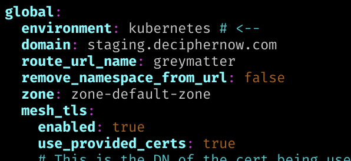
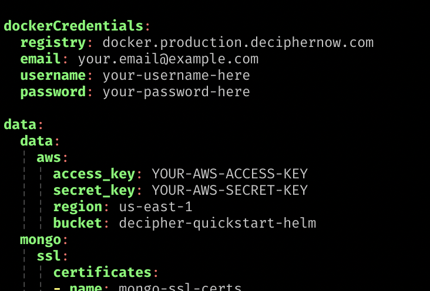
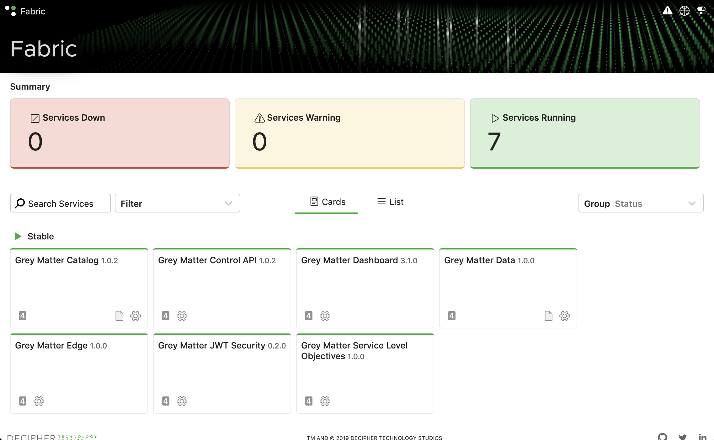

# Grey Matter Installation Training

[TOC]

These are instructions on how to install Grey Matter on a single EC2 instance for use in service development. They assume you have an AWS account and know how to use it to provision an instance (though nothing precludes the user from adapting these instructions to a similar cloud instance running on, e.g., Azure).

To successfully complete this tutorial you will need

* Access to AWS Management Console with permission to create EC2s.
* AWS credentials in the form of an AWS access key and secret key
* Decipher Docker registry credentials (i.e., to docker.production.deciphernow.com) in the form of a username and password
* SSH or PuTTY (instructions will be given for SSH, and PuTTY users will need to adapt them to their needs)

## Launching a machine 

Begin by launching a

1. the default Ubuntu Server AMI 
2. into a t2.2xlarge
3. with 32 GB storage (the default is 8)
4. and TCP port `30000` open in its security group.

Leave all other parameters set to their defaults, including the default security group. (We will update it later once we know what port to use.)

At time of writing, this can be accomplished by clicking Launch Instance from the EC2 console, selecting the first Ubuntu Server 18.04 LTS AMI and clicking Select, choosing t2.2xlarge and clicking Review and Launch, clicking the "Edit storage" link near the bottom-right, and changing the Size from 8 to 32, clicking Review and Launch again, clicking Launch, and setting up or reusing a keypair. The default security group should already allow SSH, so we can proceed.

Go to Running Instances in the EC2 console, select the instance you just launched, and copy out the IP address. Use this to SSH into your server. The Ubuntu EC2 AMI uses user "ubuntu".

For example, if the public IP address of your instance is `34.227.100.211`, and you stored your key pair file as `~/.ssh/training.pem`, (`chmod 600`) log in with 

``` bash
ssh -i ~/.ssh/training.pem ubuntu@34.227.100.211
```

We are now ready to install the prerequisites for this tutorial on the EC2 instance.

## Installing prerequisites

We will install Docker, kubectl, Helm, and Minikube on our freshly launched EC2 server.

``` bash
sudo apt update

# Docker (and socat, a dependency of helm)
sudo apt install docker.io socat -y

# Kubectl
sudo snap install kubectl --classic

# Helm
sudo snap install helm --classic --channel=2.16

# Minikube
curl -Lo minikube https://storage.googleapis.com/minikube/releases/latest/minikube-linux-amd64 \
  && chmod +x minikube
  
sudo mkdir -p /usr/local/bin/
sudo install minikube /usr/local/bin/
```

## Minikube setup

Now we start Minikube with enough CPU and memory allocated for a full installation of Grey Matter:

``` bash
sudo minikube start --vm-driver=none --kubernetes-version='v1.17.0'
```

> NOTE: If anything goes wrong, it should be safe to do `sudo minikube delete` to return you to the step right before Minikube was started, ready to retry.

And initialize Helm by installing Tiller into our new Minikube installation:

``` bash
sudo helm init
```

Confirm that Tiller has actually started before moving on. `tiller-deploy` should be `1/1 Running`:

``` bash
sudo kubectl get pods -n kube-system
```

Then setup Voyager (for exposing an ingress port - more on this later).

``` bash
sudo helm repo add appscode https://charts.appscode.com/stable/

sudo helm repo update

sudo helm install appscode/voyager --name voyager-operator --version 12.0.0-rc.1 \
  --namespace kube-system \
  --set cloudProvider=minikube \
  --set enableAnalytics=false \
  --set apiserver.enableAdmissionWebhook=false
```

Confirm that Voyager has started before moving on. `voyager-voyager-operator` should be `1/1 Running`:

``` bash
sudo kubectl get pods -n kube-system
```

## Grey Matter configuration

### Helm overrides

Next you will make yourself custom Helm configuration overrides using two Decipher templates. Run `wget` from your EC2 instance to get the templates:

```bash
wget https://raw.githubusercontent.com/DecipherNow/helm-charts/2.1.8/greymatter.yaml

wget https://raw.githubusercontent.com/DecipherNow/helm-charts/2.1.8/greymatter-secrets.yaml
```

> Note: The templates for these files change _very_ frequently, tracking updates to the Grey Matter helm charts. You should always get the latest version of these files, even if you already have older versions, and make your edits again.

- [greymatter.yaml](https://github.com/DecipherNow/helm-charts/blob/release-2.0/greymatter.yaml) contains many Grey Matter options you may want to adjust some day, but for our purposes you only need to change one thing: Replace the value of `global.environment` with "kubernetes":
    
    

- [greymatter-secrets.yaml](https://github.com/DecipherNow/helm-charts/blob/release-2.0/greymatter-secrets.yaml) contains secrets, passwords, and certificates. For our purposes here, just fill in your Docker registry credentials and AWS credentials, like so:

    

Save your changes to these two files and proceed.

### Decipher Helm repository

We're now going to add another Helm repository, this time for Grey Matter itself, and use it to install the latest release.

You will need your Nexus email and password.

``` bash
sudo helm repo add decipher https://nexus.production.deciphernow.com/repository/helm-hosted --username 'EMAIL' --password 'YOUR PASSWORD'

sudo helm repo update
```

## Grey Matter installation

And now, the moment we've all been waiting for... We will use the two configuration override files we created earlier to install Grey Matter. We'll start with the `--dry-run` flag to check our configs _only_, then remove it to do the actual installation.

``` bash
sudo helm install decipher/greymatter -f greymatter.yaml -f greymatter-secrets.yaml --name gm --version 2.1.8 --dry-run
```

If you see no errors with `--dry-run`, and all you see is `NAME: gm`, then it's safe to remove `--dry-run` flag and re-run. Do so now.

Grey Matter should now be starting. This takes a while to stabilize, and you can monitor the process with

``` bash
watch sudo kubectl get pods
# Ctrl-C to escape
```

Don't worry if you see `Error` and `CrashLoopBackOff`. This is normal, as each component of the system retries until its dependencies are available. `catalog-init` especially takes a while to execute without error.

Once everything is either `Running` or `Completed`, Grey Matter is up and running.

The last bit of setup necessary before we can see the dashboard is to add the Grey Matter quickstart certificate to your _local machine's_ browser/keychain. The exact steps differ between operating systems and browsers, but for Chrome you should be able to simply [download `quickstart.zip` from here](https://drive.google.com/open?id=1YEyw5vEHrXhDpGuDk9RHQcQk5kFk38uz), extract the certificates, and double-click on `quickstart.p12` to import it into your OS' keychain. The password is `password`.

If you are certain that you have installed the certificate correctly, and yet Chrome/Chromium still won't let you open the page, especially on a Linux machine, there is a trick for bypassing the security check and getting to the page: Click anywhere on the warning page, and type (nowhere in particular) "thisisinsecure". This may work when all other attempts fail.

For Firefox, you can import the certificate directly into the browser from the Certificates section of the settings, though a wide variety of combinations and browser versions tested seem to have trouble of some kind or other. Certificates are finicky.

> NOTE: In actual production deployments, you would be replacing the entire PKI certificate setup (in greymatter-secrets.yaml) with a secure one. The provided quickstart certificates are for demonstration purposes only.

Finally, navigate to `https://{your-ec2-public-ip}:30000`. Your browser will complain that the certificate is untrusted, but you may safely ignore that for now. Proceed with temporarily trusting the quickstart self-signed certificates. You should see your very own instances of the Grey Matter Intel 360 Dashboard, showing the seven core Grey Matter services.



## Verifying the deployment

Although all services show green, it is always a good idea at this point to confirm the integrity of the deployment with test requests. Decipher maintains a test suite for this purpose that exercises the various components of the system, in the form of exported Postman collections, run with Postman's headless CLI, Newman. These can be run from the `docker.production.deciphernow.com/deciphernow/gm-integrity:latest` container, which is configured through environment variables.

Since the Grey Matter Integrity project defaults to the quickstart user certificate, to run all tests against your quickstart environment you need only pass it the URL:

``` bash
sudo docker login docker.production.deciphernow.com

sudo docker run --rm -e URL={your-ec2-public-ip}:30000 docker.production.deciphernow.com/deciphernow/gm-integrity
```

## Troubleshooting a deployment

This section covers some of the tools available for probing a misbehaving deployment.

> `TODO`: Expand and combine with service deployment troubleshooting
