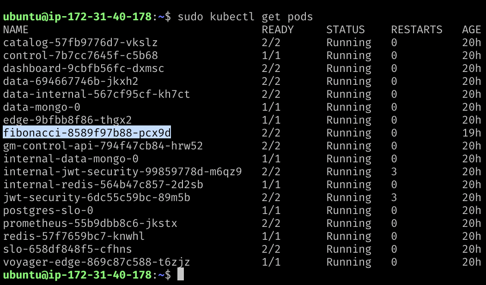
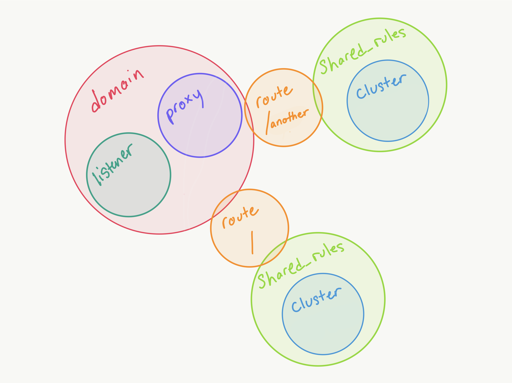
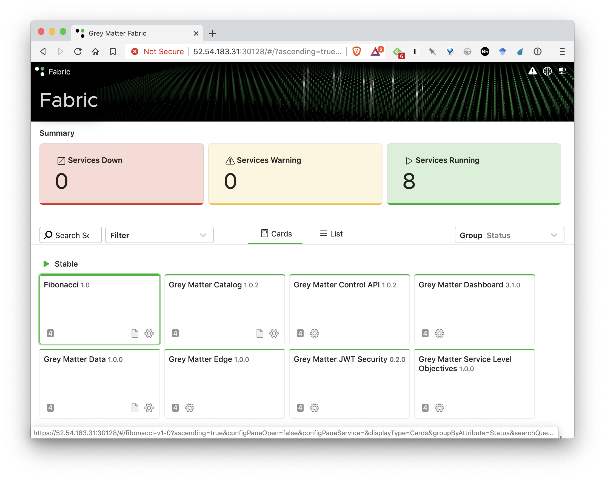

# Grey Matter Service Deployment Training

[TOC]

These are instructions on how to deploy a new service into Grey Matter. They assume you already have a Grey Matter deployment ready and accessible as a result of following the quickstart deployment training to create a personal EC2 running Grey Matter with Minikube.

They also assume access to the PEM-encoded x509 quickstart certificates, [downloadable from here](https://drive.google.com/open?id=1YEyw5vEHrXhDpGuDk9RHQcQk5kFk38uz).

Until now we have only needed them on our local machine, to provide authentication from your browser. For configuring the Grey Matter CLI on the EC2 instance, we will need them on the server as well. SCP the certificates to your server, or alternatively use `wget` to download the zip and unzip it directly on the EC2:

```bash
wget 'https://docs.google.com/uc?export=download&id=1YEyw5vEHrXhDpGuDk9RHQcQk5kFk38uz' -O quickstart.zip
sudo apt install unzip
unzip quickstart.zip -d certs/
sudo mkdir /etc/ssl/quickstart
sudo mv certs/ /etc/ssl/quickstart/certs
```

## Download the latest Grey Matter CLI

We will be configuring the mesh with the latest Grey Matter CLI, [available after authentication from Decipher's Nexus repository](https://nexus.production.deciphernow.com/#browse/browse:raw-hosted:greymatter%2Fgm-cli). Note: the link will say `Not Found`, sign in using the same docker nexus credentials in the top right corner.  Download the latest available version, and untar the package. At time of writing, the latest version is `v1.1.0`, which will be used in the below example.

The simplest way to get the `greymatter` CLI binary onto your server is to `wget` it from Decipher's Nexus repository using your credentials. Do this in your EC2:

``` bash
wget --user 'YOUR-USERNAME' --password 'YOUR-PASSWORD' https://nexus.production.deciphernow.com/repository/raw-hosted/greymatter/gm-cli/greymatter-v1.1.0.tar.gz
```

Then, still inside your EC2, make `greymatter.linux` executable, and move it into your path while renaming it to `greymatter`:

``` bash
chmod +x greymatter.linux
sudo mv greymatter.linux /usr/local/bin/greymatter
```

> Note: It is absolutely necessary that the binary be _renamed_ and put into your path for it to work. This is a known issue, and will be fixed in future versions.

## Configuring the Grey Matter CLI

Much of what follows involves the Grey Matter CLI. This is a standalone binary, usually configured through environment variables, that interacts with the Grey Matter Control API to configure services within the mesh.

We begin by configuring the CLI to connect to the Control API. You can copy and paste this entire block in. An explanation follows.

``` bash
# A convenient trick for discovering your EC2's host and port
export HOST=$( curl -s http://169.254.169.254/latest/meta-data/public-ipv4 )
export PORT=30000

echo https://$HOST:$PORT

# 1
export GREYMATTER_API_HOST="$HOST:$PORT"
# 2
export GREYMATTER_API_PREFIX='/services/gm-control-api/latest'
# 3
export GREYMATTER_API_SSLCERT="/etc/ssl/quickstart/certs/quickstart.crt"
# 4
export GREYMATTER_API_SSLKEY="/etc/ssl/quickstart/certs/quickstart.key"
# 5
export GREYMATTER_CONSOLE_LEVEL='debug'
# 6
export GREYMATTER_API_SSL='true'
# 7
export GREYMATTER_API_INSECURE='true'
```

These environment variables setup the CLI to

1. Point to your EC2's exposed edge host and IP.
2. Navigate to the control API's root URL.
3. Setup your user certificate
4. and its associated key.
5. Set a logging level appropriate for this tutorial.
6. Use `https` instead of `http` when making requests to the Control API service.
7. Don't attempt to verify the server identity (for this tutorial).

Now, place the entirety of the above code block at the end of your `~/.profile`, since we want this configuration to persist. This is important both so that the `greymatter` command continues to function after a logout, and also so that you can open multiple SSH sessions without worrying about reconfiguring it.

Verify your CLI connection with:

``` bash
greymatter list cluster
```

If successful, this should return a JSON representation of the "clusters" (meaning, in Envoy parlance, the logical services known to the discovery mechanism).

> NOTE: `cluster` is singular, and a request for `clusters` will fail. This pattern holds with the CLI for most object types.

## Launching a new service

The first stage to installing a new service into the mesh is to launch the actual service and its sidecar. For our purposes here, we use our Minikube deployment from a previous tutorial, and therefore the deployment configuration is a Kubernetes configuration file. For simplicity, we launch a common Decipher test image: the Fibonacci service.

The files discussed in this section [can be found here in fib.zip](https://drive.google.com/open?id=10s3emQdJvpLsOa0bJM4W_u66f4OxVOCY). Unzip the `fib/` directory so you can follow along. We will examine each file as we deploy it.

You can download this file directly onto your EC2 instance with `wget`:

```bash
wget 'https://docs.google.com/uc?export=download&id=10s3emQdJvpLsOa0bJM4W_u66f4OxVOCY' -O fib.zip

unzip fib.zip

cd fib/
```

### Kubernetes configuration

Here is a Kubernetes configuration typical of a Grey Matter service deployment (`fib/1_kubernetes/fib.yaml` in the zip). It contains two containers, one for the Grey Matter sidecar, and one for the Fibonacci service itself. These both launch into a common pod, labeled "fibonacci".

``` yaml
apiVersion: apps/v1
kind: Deployment
metadata:
  name: fibonacci
spec:
  selector:
    matchLabels:
      app: fibonacci
  replicas: 1
  template:
    metadata:
      labels:
        app: fibonacci
    spec:
      containers:
      - name: fibonacci
        image: docker.production.deciphernow.com/services/fibonacci:latest
        ports:
        - containerPort: 8080
      - name: sidecar
        image: docker.production.deciphernow.com/deciphernow/gm-proxy:latest
        imagePullPolicy: Always
        ports:
        - name: proxy
          containerPort: 9080
        - name: metrics
          containerPort: 8081
        env:
        - name: PROXY_DYNAMIC
          value: "true"
        - name: XDS_CLUSTER
          value: fibonacci
        - name: XDS_HOST
          value: control.default.svc.cluster.local
        - name: XDS_PORT
          value: "50000"
      imagePullSecrets:
      - name: docker.secret
```

> Note: This is a minimal deployment configuration. In case you're unfamiliar with Kubernetes configuration: The header boilerplate and the names of the configured `containerPorts` may seem particularly ripe for pruning, but resist the temptation. We will revisit this and explain why in the mesh configuration training.

Notice that the service itself is listening on port 8080, and the sidecar is listening on 9080 and 8081. Soon we will configure the sidecar to proxy 9080 → 8080, and expose collected statistics to Prometheus on 8081.

Another salient feature is that the sidecar is largely unconfigured. It is given only enough information to know that it should contact the control plane to request configuration (`PROXY_DYNAMIC`), where to do that (`XDS_HOST` and `XDS_PORT`), and what configuration to request (that of `XDS_CLUSTER`).

> Note: The `XDS_HOST` value must point to the namespace where the control plane aka `gm-control` has been deployed to. If the namespace is something other than `default` then you will need to change `control.default.svc.cluster.local` to `control.YOURNAMESPACE.svc.cluster.local`.

Apply this configuration with:

``` bash
sudo kubectl apply -f 1_kubernetes/fib.yaml
```

Your new deployment should appear in the `get pods` listing shortly, with 2/2 pods ready.



### Grey Matter sidecar configuration

At this point, the service and the sidecar are both launched with ports open, but the sidecar is largely unconfigured. It only knows to keep checking in with the Grey Matter control plane for updated configuration. We will now send that configuration for the fibonacci service to the control plane.

There are six configuration objects necessary to configure the sidecar, represented by six JSON files (in `fib/2_sidecar/` in the zip). We will go through each of them as we deploy them.

> Note: A successful response to each `greymatter` CLI request will closely resemble the object sent, with three caveats:

  1. The response omits misspelled key names, which can be a source of confusion, so check carefully that all keys sent were received as expected.
  2. It may omit settings that match the defaults, depending on the command. E.g., `edit` omits defaults.
  3. It contains a checksum, which when using `edit` must not be changed (because it's used by Grey Matter Control to enforce isolation of updates).

#### Cluster

In Envoy parlance, a "cluster" corresponds to a virtual service load balanced across one or more cluster "instances". So for example, a hypothetical bookmarks service would be considered a "cluster" to Grey Matter, and the actual running code, along with its sidecar, would make up an instance of this bookmarks cluster. We create a cluster _configuration_ whenever we want a Grey Matter sidecar proxy to be able to communicate with instances of another cluster, or with the service itself. In other words, anything at all the sidecar will need to communicate with is a "cluster".

Here we configure just one cluster, corresponding to the actual service code running next to the sidecar. We will later refer to this cluster (in our `proxy` config) using the `cluster_key` specified here to setup the request proxying.

Here is the contents of `cluster.json`:

``` json
{
    "zone_key": "zone-default-zone",
    "cluster_key": "fibonacci-service",
    "name": "service",
    "instances": [
        {
            "host": "localhost",
            "port": 8080
        }
    ]
}
```

We send it to Grey Matter with:

``` bash
greymatter create cluster < 2_sidecar/cluster.json
```

#### Domain

Domains provide namespaces for routes. To simplify and decentralize routing configuration, we often recommend making a new domain for each service.

Here is the contents of `domain.json`, a minimal configuration to create the 'fibonacci' domain. (For our purposes here, we create a whole new domain for each service):

``` json
{
    "zone_key": "zone-default-zone",
    "domain_key": "fibonacci",
    "name": "*",
    "port": 9080
}
```

We send it to Grey Matter with:

``` bash
greymatter create domain < 2_sidecar/domain.json
```

#### Listener

Listener configuration  connects a domain, IP, and port to a protocol.

> Note: It is a potential source of confusion that domains and listeners overlap in functionality, and they may in fact be merged in future versions. Listeners and domains differ mainly in the one-many relationship between listeners and their associated domains, i.e., you can configure a single listener and attach it to multiple domains. The configuration associated with a listener would then apply to multiple domains without duplication.

Here is the contents of `listener.json`:

``` json
{
    "zone_key": "zone-default-zone",
    "listener_key": "fibonacci-listener",
    "domain_keys": ["fibonacci"],
    "name": "fibonacci",
    "ip": "0.0.0.0",
    "port": 9080,
    "protocol": "http_auto"
}
```

We send it to Grey Matter with:

``` bash
greymatter create listener < 2_sidecar/listener.json
```

#### Shared Rules

Shared rules contain reusable traffic management configuration, for implementing traffic shaping, fault-injection, A/B testing, canary deployments, dark launches, shadowing, splitting, etc. Routes refer to shared rules by their `shared_rules_key`, as will be demonstrated next.

The following configuration object implements a minimal shared rule for simple traffic routing to the cluster we defined above, using the "light" (normal, live traffic path, along which a response will be returned). Other possibilities might involve the "dark", (a target for a send-and-forget copy of the request) or "tap" (a target for a copy of the request, where the response is compared to that of the "light" path) paths.

Here is the contents of `shared_rules.json`:

``` json
{
    "zone_key": "zone-default-zone",
    "shared_rules_key": "fibonacci-shared-rules",
    "name": "fibonacci",
    "default": {
        "light": [
            {
                "cluster_key": "fibonacci-service",
                "weight": 1
            }
        ]
    }
}
```

We send it to Grey Matter with:

``` bash
greymatter create shared_rules < 2_sidecar/shared_rules.json
```

#### Route

Routes connect URL paths to domains, which are later connected to clusters in the `proxy` configuration. Notice that this configuration object references the `shared_rules_key` defined above.

Here is the contents of `route.json`:

``` json
{
    "zone_key": "zone-default-zone",
    "domain_key": "fibonacci",
    "route_key": "fibonacci-route",
    "path": "/",
    "shared_rules_key": "fibonacci-shared-rules"
}
```

We send it to Grey Matter with:

``` bash
greymatter create route < 2_sidecar/route.json
```

#### Proxy

Finally, a proxy configuration ties all of the configuration we've been building up so far to an _actual sidecar_. You may recall earlier we configured the sidecar via environment variable to request configuration for a particular cluster name? That value (`XDS_CLUSTER`) must match the `name` key in this configuration file, which associates it with domains and listeners.

This configuration also configures two of the most important Grey Matter filters, for metrics and observables.

Here is the contents of `proxy.json`:

``` json
{
    "zone_key": "zone-default-zone",
    "proxy_key": "fibonacci-proxy",
    "domain_keys": ["fibonacci"],
    "listener_keys": ["fibonacci-listener"],
    "name": "fibonacci",
    "active_proxy_filters": ["gm.metrics", "gm.observables"],
    "proxy_filters": {
        "gm_metrics": {
            "metrics_port": 8081,
            "metrics_host": "0.0.0.0",
            "metrics_dashboard_uri_path": "/metrics",
            "metrics_prometheus_uri_path": "/prometheus",
            "metrics_ring_buffer_size": 4096,
            "prometheus_system_metrics_interval_seconds": 15,
            "metrics_key_function": "depth"
        },
        "gm_observables": {
            "emitFullResponse": false,
            "useKafka": false,
            "eventTopic": "observables",
            "enforceAudit": false,
            "topic": "fibonacci",
            "kafkaZKDiscover": false,
            "kafkaServerConnection": "kafka-default.fabric.svc:9092"
        }
    }
}
```

We send it to Grey Matter with:

``` bash
greymatter create proxy < 2_sidecar/proxy.json
```

### What?

It would be understandable if, by this point, you were lost in the sea of configuration files. Logical separation  enables minute control of each conceptual aspect of the system, but it does make it more difficult to comprehend at a glance. Let's review at a high level to cement the big picture.



> Note: All configuration above uses the same zone_key, which provides a logical scope to the configuration. Zones represent logical mesh deployments, and may be used to support multi-tenancy. This particular zone key was setup for us when the helm charts for Grey Matter were created. You can list the configured zones with `greymatter list zone`.
> `TODO`: Write-up overview script.

### Grey Matter edge configuration

We've now configured the sidecar itself, but there's one other instance of Grey Matter proxy in the request chain that we haven't yet configured: the edge proxy. It runs exactly the same code as a sidecar, but with different configuration that causes it to behave as a reverse proxy for the whole deployment (all other sidecars).

The form of its configuration will be familiar, though with slightly more complex route configuration. It should give you some perspective on the variation in configuration possible with Grey Matter proxy.

There are four configuration objects necessary to configure the edge for our new service, represented by four JSON files (in `fib/3_edge/` in the zip). We will go through each of them as we deploy them.

> Note: There are four configuration files _in addition to_ the configuration the edge proxy already has. It was configured as an edge proxy by the Helm installation, and what we're doing here is _adding_ some configuration so that the edge proxy will be able to route traffic to the Fibonacci service.

#### Edge Cluster

Here is the contents of `fib-cluster.json`:

``` json
{
    "zone_key": "zone-default-zone",
    "cluster_key": "edge-fibonacci-cluster",
    "name": "fibonacci",
    "instances": [],
}
```

We send it to Grey Matter with:

``` bash
greymatter create cluster < 3_edge/fib-cluster.json
```

#### Edge Shared Rules

Here is the contents of `fib-shared_rules.json`:

``` json
{
    "zone_key": "zone-default-zone",
    "shared_rules_key": "edge-fibonacci-shared-rules",
    "name": "fibonacci",
    "default": {
        "light": [
            {
                "cluster_key": "edge-fibonacci-cluster",
                "weight": 1
            }
        ]
    }
}

```

We send it to Grey Matter with:

``` bash
greymatter create shared_rules < 3_edge/fib-shared_rules.json
```

#### Edge Route (for route with trailing slash)

Here is the contents of `fib-route.json`:

``` json
{
    "zone_key": "zone-default-zone",
    "domain_key": "edge",
    "route_key": "edge-fibonacci-route-slash",
    "path": "/services/fibonacci/1.0/",
    "prefix_rewrite": "/",
    "shared_rules_key": "edge-fibonacci-shared-rules",
}
```

We send it to Grey Matter with:

``` bash
greymatter create route < 3_edge/fib-route.json
```

#### Edge Route 2 (adds missing trailing slash)

Here is the contents of `fib-route-2.json`:

``` json
{
    "zone_key": "zone-default-zone",
    "domain_key": "edge",
    "route_key": "edge-fibonacci-route",
    "path": "/services/fibonacci/1.0",
    "prefix_rewrite": "/services/fibonacci/1.0/",
    "shared_rules_key": "edge-fibonacci-shared-rules",
}
```

We send it to Grey Matter with:

``` bash
greymatter create route < 3_edge/fib-route-2.json
```

If you've followed alone up to this point, you should have a service deployed! Try to reach it at `https://{your-ec2-public-ip}:{port}/services/fibonacci/1.0/`. If you get "Alive", try requesting the 37th Fibonacci number with `/services/fibonacci/1.0/fibonacci/37`. If you get `no healthy upstream` instead, try waiting for a few minutes before retrying. The changes to the control plane make take a few minutes to propogate changes down to the sidecars.

See the Troubleshooting section below if for any other reason your service seems unresponsive.

### Catalog service configuration

If your service responds to your call, there is yet one final step remaining: Your Catalog service entry. The Grey Matter Intel 360 Dashboard depends on the Catalog service for information on each running service, and we will make an entry for our service now by POSTing to the Catalog service's `/clusters` endpoint.

``` json
{
    "clusterName": "fibonacci",
    "zoneName": "zone-default-zone",
    "name": "Fibonacci",
    "version": "1.0",
    "owner": "Decipher",
    "capability": "Tutorial",
    "runtime": "GO",
    "documentation": "/services/fibonacci/1.0/",
    "prometheusJob": "fibonacci",
    "minInstances": 1,
    "maxInstances": 2,
    "authorized": true,
    "enableInstanceMetrics": true,
    "enableHistoricalMetrics": true,
    "metricsPort": 8081
}
```

In the same terminal where you set the environment variables for the Grey Matter CLI, in the `fib/` directory, run the below command to create the entry in the Catalog service.

``` bash
curl -XPOST https://$GREYMATTER_API_HOST/services/catalog/latest/clusters --cert $GREYMATTER_API_SSLCERT --key $GREYMATTER_API_SSLKEY -k -d "@4_catalog/entry.json"
```

Congratulations, you have successfully deployed a service to Grey Matter!



## Troubleshooting

> `TODO`: Expand and merge with installation troubleshooting

If you have any trouble following these instructions, or any feedback, please submit a ticket at https://support.deciphernow.com, where we also maintain a knowledgebase and further troubleshooting information.

Below are a few common problems encountered with these instructions in particular and associated explanations and solutions.

### 404

If the 404 is only for the correct URL for your service (`/services/fibonacci/1.0/`) then a missing route configuration is the most likely cause. Check that the response from control when you did your `greymatter create route < 2_sidecar/route.json` looks correct.

### "No healthy upstream"

If you just deployed your service, wait a few minutes. To avoid network chattiness, the control plane sometimes waits between updates. If it has been more than five minutes and the error is still there, the sidecar is likely not correctly configured to talk to its service.

### "Upstream connect error or disconnect/reset before headers"

The edge proxy is likely not configured correctly to talk to the service, or the service cannot be found for some other reason. Check the service announcement/discovery pathway.

1. In the Kubernetes config, is the service's `spec.template.metadata.labels` `app: fibonacci` label intact?

### Troubleshooting the greymatter cli configuration

If you're using the cli (running any command that looks like `greymatter ...`), and you see an error, try running `greymatter` and check that your configuration (listed at the bottom) looks something like this:

```bash
Options currently configured from the Environment:

GREYMATTER_API_HOST=12.345.6.78:31234
GREYMATTER_API_INSECURE=true
GREYMATTER_API_PREFIX=/services/gm-control-api/latest
GREYMATTER_API_SSL=true
GREYMATTER_API_SSLCERT=/etc/ssl/quickstart/certs/quickstart.crt
GREYMATTER_API_SSLKEY=/etc/ssl/quickstart/certs/quickstart.key
GREYMATTER_CONSOLE_LEVEL=debug
```

If you don't see any of the above variables, or some variables are missing, rerun the following:

```bash
export HOST=$( curl -s http://169.254.169.254/latest/meta-data/public-ipv4 )
export PORT=30000
export GREYMATTER_API_HOST="$HOST:$PORT"
export GREYMATTER_API_PREFIX='/services/gm-control-api/latest'
export GREYMATTER_API_SSLCERT="/etc/ssl/quickstart/certs/quickstart.crt"
export GREYMATTER_API_SSLKEY="/etc/ssl/quickstart/certs/quickstart.key"
export GREYMATTER_CONSOLE_LEVEL='debug'
export GREYMATTER_API_SSL='true'
export GREYMATTER_API_INSECURE='true'
```

Run `greymatter` again, if everything looks correct try your command again.  If you are still seeing errors, see below to troubleshoot your greymatter cli configuration.

1. If the error you see looks like:

    ```bash
    list: could not successfully make request to https://:443/services/gm-control-api/latest/v1.0/cluster?filters=%5B%7B%22cluster_key%22%3A%22%22%2C%22name%22%3A%22%22%2C%22zone_key%22%3A%22%22%2C%22org_key%22%3A%22%22%7D%5D: Get https://:443/services/gm-control-api/latest/v1.0/cluster?filters=%5B%7B%22cluster_key%22%3A%22%22%2C%22name%22%3A%22%22%2C%22zone_key%22%3A%22%22%2C%22org_key%22%3A%22%22%7D%5D: dial tcp :443: connect: connection refused
    ```

    `GREYMATTER_API_HOST` is likely incorrectly configured. Run `echo $GREYMATTER_API_HOST`, then run `sudo minikube service list` and check that the lower of the ports listed in voyager-edge matches the port at the end of your variable. (Newer versions of the helm charts pin the port to 30000, but older versions may have a different port.) If it doesn't match either voyager-edge port copy the first port and run `export PORT={your-voyager-edge-port}`. If one of them does match, try the other port. Then run the following,

    ```bash
    export HOST=$( curl -s http://169.254.169.254/latest/meta-data/public-ipv4 )
    export GREYMATTER_API_HOST="$HOST:$PORT"
    ```

    Try your command again. If you still see the same error, check that `HOST` matches your ec2 public ip.

2. If the error you are seeing looks like `stat /etc/ssl/quickstart/certs/quickstart.crt: no such file or directory`, verify that your quickstart certificates are in the `/etc/ssl/quickstart/certs` directory by running `ls -al /etc/ssl/quickstart/certs`, you should see:

    ```bash
    drwxrwxr-x 3 ubuntu ubuntu 4096 Nov 21 23:25 .
    drwxr-xr-x 3 root   root   4096 Nov 21 23:20 ..
    drwxrwxr-x 2 ubuntu ubuntu 4096 Oct 29 20:30 __MACOSX
    -rw-r--r-- 1 ubuntu ubuntu 6590 Sep 26 18:57 quickstart.crt
    -rw-r--r-- 1 ubuntu ubuntu 6115 Sep 26 18:57 quickstart.jks
    -rw-r--r-- 1 ubuntu ubuntu 1679 Sep 26 18:57 quickstart.key
    -rw-r--r-- 1 ubuntu ubuntu 6437 Sep 26 18:57 quickstart.p12
    ```

If you don't see this, or you see `No such file or directory`, re-download the quickstart certs at the top of this page and try again.
