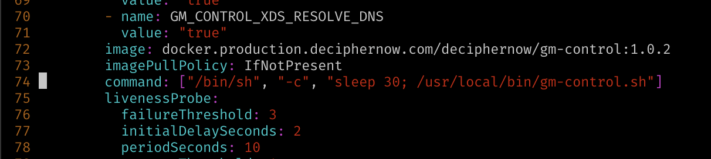
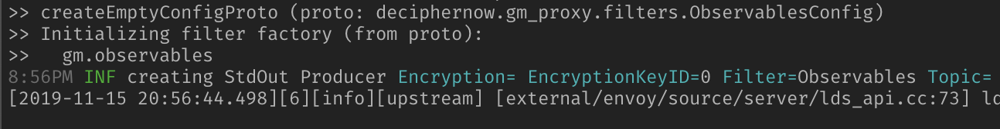

# Grey Matter Configuration Training

These are instructions on how to configure various aspects of the Grey Matter service mesh and underlying platform to accomplish common goals.

It assumes you have gone through the Grey Matter installation training and service deployment training, so you have Grey Matter running on your own EC2 instance.

[TOC]

## Discovery mechanisms

Service discovery allows services to communicate transparently with a member of a cluster without having to know its identity, or even how many members there are. When a member joins or leaves the cluster, it is transparently added to or removed from the load-balancing list.

Grey Matter supports several different service discovery mechanisms, with more to come. Here is a short explanation of the workings of each one.

### Kubernetes

If you followed along with the service deployment training, you will have seen this typical Kubernetes deployment config file. The default deployment relies on Kubernetes service discovery, so let's take a closer look at that. Glance this file again, and notice the extra comments.

``` yaml
apiVersion: apps/v1
kind: Deployment
metadata:
  name: fibonacci
spec:
  selector:
    matchLabels:
      app: fibonacci
  replicas: 1
  template:
    metadata:
      labels:
        app: fibonacci # <- Important for service discovery
    spec:
      containers:
      - name: fibonacci
        image: docker.production.deciphernow.com/deciphernow/fibonacci:latest
        ports:
        - containerPort: 8080
      - name: sidecar
        image: docker.production.deciphernow.com/deciphernow/gm-proxy:latest        
        imagePullPolicy: Always
        ports:
        - name: proxy         # <- Important for
          containerPort: 9080 # <- service discovery
        - name: metrics
          containerPort: 8081
        env:
        - name: PROXY_DYNAMIC
          value: "true"
        - name: XDS_CLUSTER
          value: fibonacci
        - name: XDS_HOST
          value: control.default.svc.cluster.local
        - name: XDS_PORT
          value: "50000"
      imagePullSecrets:
      - name: docker.secret
```

Notice the "Important for service discovery" comments. `spec.template.metadata.labels` contains `app: fibonacci`, which puts an arbitrary label on the service for purposes of service discovery. Grey Matter Control is configured (by environment variable) to use this label to match instances to clusters. Control is also configured to use a port labeled `proxy` to determine which port to route traffic to. (As well as a port labeled `metrics` from which to collect metrics.)

Let's now look at the Grey Matter Control environment on our EC2 with `kubectl describe`, to see how things need to match up:

```bash
sudo kubectl describe deployment/control
```

This yields details about the deployment, most relevantly these three environment variables controlling details of Kubernetes service discovery:

```plain
...
      GM_CONTROL_KUBERNETES_CLUSTER_LABEL:	app
      GM_CONTROL_KUBERNETES_NAMESPACES:		default
      GM_CONTROL_KUBERNETES_PORT_NAME:		proxy
...      
```

This is saying that a service discovered in the `default` namespace (extra namespaces can be added, comma-delimited) will have its `app` label metched to a configured cluster of the same name, and the `proxy` port will be used to load-balance traffic to that pod when an instance of that cluster is required.

To make this more concrete, remember that while deploying the Fibonacci service earlier, we sent this `fib-cluster.json` to the Grey Matter Control API. This made the edge proxy aware of the fibonacci sidecar:

``` json
{
    "zone_key": "zone-default-zone",
    "cluster_key": "edge-fibonacci-cluster",
    "name": "fibonacci",
    "instances": [],
}
```

But wait, `instances` was empty! Why then were we able to connect to our service through the edge? The answer is that those empty instances were filled in by Control's ability to discover services. The `"name": "fibonacci"` in this cluster config and the `app: fibonacci` in the Kubernetes config must match for Control to notice a new pod and include it in load balancing behind the "fibonacci" cluster identity.

### Consul

As an alternative to Kubernetes service discovery, we can use Consul to discover services. You might want to do this if you already have an investment in Consul, or if you want to host your services apart from Kubernetes.

To demonstrate how this is done, we will deploy Consul into our Minikube installation, and then re-deploy Grey Matter configured to use Consul instead of Kubernetes for service discovery.

#### Redeploying Grey Matter

Let's start by tearing down our previous Grey Matter installation. This is for simplicity and speed, since in actual practice you would likely prefer to modify it in place.

This will destroy our existing Grey Matter installation:

```bash
sudo helm del --purge gm
sudo kubectl delete deployment/fibonacci
```

Lets make a new directory where we will house the configuration related content:

```bash
mkdir configuration
cd configuration/
```

Then we want to install Consul, using their official Helm charts, modified to allow a single-node installation. This can be done by cloning their repository,


```bash
git clone https://github.com/hashicorp/consul-helm.git
```

and editing `values.yaml` to comment out all of the `affinity` sections (which would prevent various components of Consul from being installed on the same node). *Note* There are three of these sections.

```bash
nano consul-helm/values.yaml # <- comment affinity sections
```

Finally, we install Consul with Helm.

```bash
sudo helm install ./consul-helm --name consul
```

> Note: These instructions will assume the Helm deployment is named `consul`, as specified above. If you change this value in your own installations, be sure to update the references to it below.

Firs, grab `greymatter.yaml` and `greymatter-secrets.yaml` that correspond to the new setup.

```bash
wget https://raw.githubusercontent.com/DecipherNow/helm-charts/release-2.0/greymatter.yaml

wget https://raw.githubusercontent.com/DecipherNow/helm-charts/release-2.0/greymatter-secrets.yaml
```

Once again, modify the `greymatter-secrets.yaml` file with your Docker registry credentials and AWS credentials, the top of the file should look like:


Now we will modify the Grey Matter installation to use Consul for service discovery. Start by copying your `greymatter.yaml` to `greymatter-consul.yaml`,

```bash
cp greymatter.yaml greymatter-consul.yaml
```

and then make the following two changes to the `greymatter-consul.yaml` file:

1. Change `global.environment` from openshift to `kubernetes`, and add the line `k8s_use_voyager_ingress: true` beneath it.
  
2. Change `global.consul.enabled` to "true", and `global.consul.host` to "consul-consul-server", as in the following screenshot.

    

3. Then skip down to `control.control.envvars`, and comment out the following environment variables to Grey Matter Control, to tell it some details about the Consul server.

    ```yaml
    gm_control_cmd:
      type: 'value'
      value: 'consul'
    gm_control_consul_dc:
      type: 'value'
      value: 'dc1'
    gm_control_consul_hostport:
      type: 'value'
      value: '{{ .Values.global.consul.host }}:{{ .Values.global.consul.port }}'
    ```

It should look similar to the following screenshot.


Save and quit.

We can now reinstall Grey Matter with a command similar to the one from before, but using `greymatter-consul.yaml` in place of `greymatter.yaml`.

First confirm that Consul has successfully started up. You should see all containers in all Consul pods running before proceeding.

```bash
sudo kubectl get pods
```


Now you can install Grey Matter with our custom configuration for Consul.

``` bash
sudo helm install decipher/greymatter -f greymatter-consul.yaml -f greymatter-secrets.yaml --name gm --version 2.0.4 --dry-run
```

If this runs successfully, (all you see is `Name: gm`) then you can remove the `--dry-run` and re-run the command to proceed. Do so now.

As before, Grey Matter will take a little while to become stable. You can watch this process with

```bash
sudo kubectl get pods -w
# Ctrl-C to escape
```

Then you can find your new port with `sudo minikube service list`, add that port to the security group in EC2, and navigate to the site in your browser. It should look identical to the earlier deployment.

To confirm that we are, in fact, using Consul service discovery, we can do `sudo kubectl describe deployment/control` to show that `GM_CONTROL_CMD` is set to `consul`. More satisfyingly, let's look at the Consul UI to confirm that Grey Matter services have registered with it.

The UI is exposed over HTTP internal to the `consul-consul-server-0` pod on port 8500, and configured to be served from `localhost`. The quickest (though perhaps not the most intuitive) way to see the UI is therefore to do two port forwards to expose the port at localhost:8500. The first port forward is done on your EC2:

```bash
sudo kubectl port-forward consul-consul-server-0 8600:8500
```

This exposes the UI server on 8600 on your EC2, but it will not accept connections at your EC2 public IP, so we do one more port-forward using SSH (or PuTTY) from our local machine to the EC2 server:

```bash
ssh -i ~/.ssh/minikube-aws.pem ubuntu@{your-ec2-ip} -L 8500:localhost:8600
```

Finally, on your local machine, you should now be able to go to http://localhost:8500 to see the Consul UI with all Grey Matter services listed alongside the consul services themselves:


#### Deploying a service with Consul

Deploying a service into the mesh is only a little different with Consul as the service discovery mechanism. You may have noticed in your pod listing earlier that each of your pods now include _three_ containers apiece, rather than two. The three containers are the service itself, the GM Proxy Sidecar, and the Consul agent.

Your services will also need a Consul agent container in each of their pods to make the actual announcement. To launch the Fibonacci service into this environment, you will need the same configuration as before, plus the following additional container under `spec.template.spec.containers`, as well as the following extra volumes for Consul under `spec.template.spec`.

Redownload the fibonacci service directory

```bash
wget 'https://docs.google.com/uc?export=download&id=10s3emQdJvpLsOa0bJM4W_u66f4OxVOCY' -O fib.zip

unzip fib.zip

cd fib/
```

Create a new deployment file, `fib-consul.yaml`.  Then copy below, paste it into the new file, save a quit.

```bash
touch 1_kubernetes/fib-consul.yaml
vi 1_kubernetes/fib-consul.yaml
```

```yaml
apiVersion: apps/v1
kind: Deployment
metadata:
  name: fibonacci
spec:
  selector:
    matchLabels:
      app: fibonacci
  replicas: 1
  template:
    metadata:
      labels:
        app: fibonacci
    spec:
      containers:
      - name: fibonacci
        image: docker.production.deciphernow.com/services/fibonacci:latest
        ports:
        - containerPort: 8080
      - name: sidecar
        image: docker.production.deciphernow.com/deciphernow/gm-proxy:latest
        imagePullPolicy: Always
        ports:
        - name: proxy
          containerPort: 9080
        - name: metrics
          containerPort: 8081
        env:
        - name: PROXY_DYNAMIC
          value: "true"
        - name: XDS_CLUSTER
          value: fibonacci
        - name: XDS_HOST
          value: control.default.svc.cluster.local
        - name: XDS_PORT
          value: "50000"
      - name: consul
        image: consul:1.5.0
        imagePullPolicy: IfNotPresent
        command: ["/bin/sh", "-ec"]
        args:
        - 'echo ''{ "Service": { "name":"$(NAME)","address":"$(POD_IP)","port":9080, "tags":["gm-cluster"],"meta":{"metrics":"8081"},"check":[{"name":"$(NAME) health check","tcp":"$(POD_IP):9080","interval":"10s"}]}}'' >/consul/config/$(NAME)-consul.json && exec /bin/consul agent -data-dir=/consul/data -advertise="$(POD_IP)" -retry-join="consul-consul-server" -config-dir=/consul/config'
        env:
        - name: POD_IP
          valueFrom:
            fieldRef:
              fieldPath: status.podIP
        - name: NAME
          value: fibonacci
        volumeMounts:
        - mountPath: /consul/data
          name: data-consul
        - mountPath: /consul/config
          name: config-consul
      imagePullSecrets:
      - name: docker.secret
      volumes:
      - name: data-consul
        emptyDir: {}
      - name: config-consul
        emptyDir: {}
```

If you run `cat 1_kubernetes/fib-consul.yaml` you should see exactly as above.

Now, apply the deployment!

```bash
sudo kubectl apply -f 1_kubernetes/fib-consul.yaml
```

> `TODO`: Include fib-consul.yaml in the zip.

Take a look at the consul ui still running at <http://localhost:8500/>, you should now see the fibonacci service has announced itself to consul.  At this time, it should be failing it's health check.  This is because the mesh has not been configured to connect to the fibonacci service yet.

So now, finally, because we reinstalled Grey Matter, we will need to reapply the Grey Matter configuration for the Fibonacci service as well. This can be done quickly with the below block of commands.

> Note: It's important that the Grey Matter CLI be configured correctly via environment variables before running this section. Run the following to reconfigure it:

```bash
export HOST=$( curl -s http://169.254.169.254/latest/meta-data/public-ipv4 )
export PORT=$( sudo minikube service list | grep voyager-edge | grep -oP ':\K(\d+)' )

export GREYMATTER_API_HOST="$HOST:$PORT"
export GREYMATTER_API_PREFIX='/services/gm-control-api/latest'
export GREYMATTER_API_SSLCERT="/etc/ssl/quickstart/certs/quickstart.crt"
export GREYMATTER_API_SSLKEY="/etc/ssl/quickstart/certs/quickstart.key"
export GREYMATTER_CONSOLE_LEVEL='debug'
export GREYMATTER_API_SSL='true'
export GREYMATTER_API_INSECURE='true'

```

Now, reconfigure the mesh for the Fibonacci service using consul.

```bash
 cd /home/ubuntu/configuration/fib/
# fib 
greymatter create cluster < 2_sidecar/cluster.json
greymatter create domain < 2_sidecar/domain.json
greymatter create listener < 2_sidecar/listener.json
greymatter create shared_rules < 2_sidecar/shared_rules.json
greymatter create route < 2_sidecar/route.json
greymatter create proxy < 2_sidecar/proxy.json

# edge
greymatter create cluster < 3_edge/fib-cluster.json
greymatter create shared_rules < 3_edge/fib-shared_rules.json
greymatter create route < 3_edge/fib-route.json
greymatter create route < 3_edge/fib-route-2.json

# catalog
curl -XPOST https://$GREYMATTER_API_HOST/services/catalog/latest/clusters --cert $GREYMATTER_API_SSLCERT --key $GREYMATTER_API_SSLKEY -k -d "@4_catalog/entry.json"

```

Once control has discovered the Fibonacci services instance, it should appear as an up service on the dashboard, and should now be passing its health checkin the consul ui.

### Flat file

Finally, as the ultimate fallback solution, Grey Matter supports service discovery using a flat file. This can be used to manually register services, or as an interface to some custom service discovery solution, since Control will hot-reload updates to this file.

This time, we will not need to tear down all of Grey Matter, because the changes necessary are isolated to Grey Matter Control. We will dump Control's configuration, edit it, and redeploy it.

```bash
cd ..
sudo kubectl get deployment control -o yaml > control.yaml
nano control.yaml  # see below for the lines to change
```

The lines to change are down in the environment variable configuration section of Control's container. If you followed the Consul instructions earlier, yours may look something like this:


**Change `GM_CONTROL_CMD` to "file"**, and add `GM_CONTROL_FILE_FILENAME` and `GM_CONTROL_FILE_FORMAT` like so:

```yaml
        - name: GM_CONTROL_FILE_FORMAT
          value: yaml
        - name: GM_CONTROL_FILE_FILENAME
          value: /tmp/routes.yaml
```

We will also do something a bit hacky for purposes of this training to get the flat file into the container: We'll alter Control's `command` so it waits 30 seconds for us to copy the file in.

So while in `control.yaml`, add this `command` line to the control container

```yaml
command: ["/bin/sh", "-c", "sleep 30; /usr/local/bin/gm-control.sh"]
```

as in this screenshot:



Also notice the `livenessProbe` block underneath. Because our 30-second delay causes Control to be unresponsive to the probe during that time, just delete that whole block (`livenessProbe` and everything indented underneath it). This will allow Control to wait for us without incident.


Save and quit.

Of course, before we actually deploy this configuration, we should actually _create_ that `routes.yaml` file. The whole point of this exercise is to introduce a flat-file service discovery table into Control. This could be somewhat tedious, since after all we're manually creating an index of all our services and their (dynamically assigned) IP addresses. However, in this case we can cheat and _generate_ `routes.yaml` from our previously configured working service discovery setup:

```bash
sudo apt install jq
greymatter list cluster | jq -r '.[] | select(.name!="service") | "- cluster: \(.cluster_key)@  instances:@  - host: \(.instances[0].host)@    port: \(.instances[0].port)@"' | tr '@' "\n" > routes.yaml
```

`cat routes.yaml`, and make sure it looks like this:

```yaml
- cluster: edge-to-dashboard-cluster
  instances:
  - host: 172.17.0.18
    port: 8080

- cluster: 4316e298e0263b39
  instances:
  - host: 172.17.0.15
    port: 8080

- cluster: edge-fibonacci-cluster
  instances:
  - host: 172.17.0.15
    port: 8080

- cluster: edge-to-slo-cluster
  instances:
  - host: 172.17.0.11
    port: 8080

...
```

Next, we will destroy the existing Control deployment, replace it with out updated one, and copy `routes.yaml` into the container.

```bash
sudo kubectl delete deployment control
```

After we deploy, we will have 30 seconds to copy in `routes.yaml`.  Deploy, get pods and copy the control pod id, and then run the last command replacing `{control-pod-id}` with what you copied.

> Note: If you don't copy the file in within 30 seconds, the logs will include `file: watch file error: no such file or directory`, and the pod will restart, giving you another chance.

```bash
sudo kubectl apply -f ./control.yaml --validate=false
sudo kubectl get pods
```

Copy the pod-id for control, and:

```bash
# use the pod name to copy routes.yaml into the container
sudo kubectl cp ./routes.yaml {control-pod-id}:/tmp/routes.yaml
```

> Note: `--validate=false` on the deployment seems to be necessary some times and not others. This is likely a bug in Kubernetes that a valid deployment configuration sometimes fails to validate.

> Note: The pod itself takes a few seconds to initialize, so if the `cp` fails complaining that the pod doesn't exist, just keep retrying until it does.

If you weren't too slow, `sudo kubectl logs deployment/control` should shortly be spitting out details about Control's workings, and you should then be running a service mesh using flat-file service discovery!

> Note: The method of delaying Control's startup and copying in the file is an expedient for training purposes, and not how you would actually do this for a real, multi-user deployment. In that case you would want to create a config map with `routes.yaml` to mount it into the container as part of Control's deployment.

It's a good idea to revert back to either dynamic service discovery mechanisms before moving on with the training. One way this can be done is by changing `GM_CONTROL_CMD` in your `control.yaml` back to `kubernetes`, and re-doing the `kubectl delete` and `apply` steps to reapply it.

``` bash
# Edit control.yaml, then redeploy with
sudo kubectl delete deployment control
sudo kubectl apply -f ./control.yaml --validate=false
```

## Securing the mesh with role-based access control (RBAC)

Go back into the fib directory, `cd /home/ubuntu/configuration/fib`.

If you earlier succeeded at deploying a service into Grey Matter, you will have sent a `proxy.json` object to the mesh, with active proxy filters "gm.metrics" and "gm.observables", you can  `cat 2_sidecar/proxy.json` to view the original object.

We will be adding another proxy filter to enforce and configure RBAC rules for a service. Reusing our Fibonacci service from before, we use the Grey Matter CLI to edit our proxy config, and add an RBAC rule.

> NOTE: We will be using the `proxy_key` defined before to locate this proxy object, which for our Fibonacci service was `fibonacci-proxy`. If you ever can't remember your proxy key, use `greymatter list proxy` to find it.

We're going to lock ourselves out of our own Fibonacci service, by making a whitelist and excluding ourselves.

First, take a look at the current proxy, `greymatter get proxy fibonacci-proxy`.  You should see the two proxy filters enabled, `gm.metrics` and `gm.observables`. Take note of the line `"envoy_rbac": null` inside the `proxy_filters`.  We will set a configuration on this filter in this section.

```json
{
  "proxy_key": "fibonacci-proxy",
  "zone_key": "zone-default-zone",
  "name": "fibonacci",
  "domain_keys": [
    "fibonacci"
  ],
  "listener_keys": [
    "fibonacci-listener"
  ],
  "listeners": null,
  "upgrades": "",
  "active_proxy_filters": [
    "gm.metrics",
    "gm.observables"
  ],
  "proxy_filters": {
    "gm_impersonation": {},
    "gm_observables": {
      "topic": "fibonacci",
      "eventTopic": "observables",
      "kafkaServerConnection": "kafka-default.fabric.svc:9092"
    },
    "gm_oauth": {},
    "gm_inheaders": {},
    "gm_listauth": {},
    "gm_metrics": {
      "metrics_port": 8081,
      "metrics_host": "0.0.0.0",
      "metrics_dashboard_uri_path": "/metrics",
      "metrics_prometheus_uri_path": "/prometheus",
      "prometheus_system_metrics_interval_seconds": 15,
      "metrics_ring_buffer_size": 4096,
      "metrics_key_function": "depth"
    },
    "envoy_rbac": null
  },
  "checksum": "643e22f77aa02a8928120837d1c19e6cbe0115ddacfea671d5fe5e8801aece39"
}
```

Run the following to open your proxy config:
```bash
export EDITOR=nano  # or whatever
greymatter edit proxy fibonacci-proxy
```

Now make the following changes:

1. In the `active_proxy_filters` field, add `"envoy.rbac"`. The resulting field should then look like:

```diff
  "active_proxy_filters": [
    "gm.metrics",
    "gm.observables",
    "envoy.rbac"
  ]
```

> Note: As you can tell from the filter name, this is in fact an unmodified Envoy filter we are enabling. As an aside, several Envoy filters are supported, and eventually they will all be available.

2. In the `proxy_filters` object, we will configure the filter. This will specify the rules to allow access to the Fibonacci service. Complex configurations can be tricky, but we will start with a simple config that should deny us from having access to the service. Replace `""envoy_rbac": null` with the following:

```diff
"envoy_rbac": {
    "rules": {
        "action": 0,
        "policies": {
            "001": {
                "permissions": 
                [
                    {"any": true}
                ],
                "principals": [
                                {"header": {"name": "user_dn","exact_match": "cn=not.you"}}
                ]
            }
        }
    }
}
```

Save and quit.

The configuration above is telling the fibonacci service to give full service access (listed in the permissions) to the principals with header `user_dn` equal to `"cn=not.you"`.  Thus, any request to the fibonacci service that doesn't contain this header will be rejected. This should lock out our user (`quickstart`).

To make sure the configuration made it through without error, `greymatter get proxy fibonacci-proxy`, and you should see both of the above changes in the new object.

Once configured, it can take several minutes for the RBAC rule to take affect. If you're following the Fibonacci service sidecar logs with `sudo kubectl logs deployment/fibonacci -c sidecar -f`, you can see the point at which it starts reloading the filters. Up to a minute after this happens, the configuration will take effect.

To test that the RBAC filter has been enabled, hit  `https://{your-ec2-public-ip}:{port}/services/fibonacci/1.0/`. When the response is `RBAC: access denied`, the filter has taken affect and you are locked out of your service! You should see the same response on any endpoint of the fibonacci service, try `https://{your-ec2-public-ip}:{port}/services/fibonacci/1.0/fibonnacci/37`.

To make sure that users with `user_dn: cn=not.you` in fact _do_ have access to the service, we will take advantage of the current setup with unrestricted impersonation to run the following.

```bash
curl -k --header "user_dn: cn=not.you" --cert /etc/ssl/quickstart/certs/quickstart.crt --key /etc/ssl/quickstart/certs/quickstart.key https://$GREYMATTER_API_HOST/services/fibonacci/1.0/
```

The response should be `Alive`. So if we impersonate the "not you" user, we are allowed access.

> Note: The next section of the training will treat impersonation security.

Now, as a second example, we will allow the quickstart certificate `GET` access to the service.  This will allow us to hit the browser endpoints.  We will still allow `cn=not.you` full access to the service, and this time we will test a `PUT` request to see that this is true.

To do this, we will add a policy giving `GET` permission to users with with the `user_dn` `"CN=quickstart,OU=Engineering,O=Decipher Technology Studios,=Alexandria,=Virginia,C=US"`.

> Note:  when using an RBAC configuration with multiple policies, the **policies are sorted lexicographically and enforced in this order**. In this example, the two policies are named "001" and "002", and will apply in that order because "002" sorts lexicographically _after_ "001".

`greymatter edit proxy fibonacci-proxy` again, and change the `"envoy_rbac"` policy to:

```diff
"envoy_rbac": {
    "rules": {
        "action": 0,
        "policies": {
            "001": {
                "permissions":
                [
                    {"any": true}
                ],
                "principals": [
                                {"header": {"name": "user_dn","exact_match": "cn=not.you"}}
                ]
            },
            "002": {
                "permissions": [
                                {"header": {"name": ":method","exact_match": "GET"}}
                ],
                "principals": [
                                {"header": {"name": "user_dn","exact_match": "CN=quickstart,OU=Engineering,O=Decipher Technology Studios,=Alexandria,=Virginia,C=US"}}
                ]
            }
        }
    }
}
```

Save and quit again.  Give the new configuration a few minutes to take effect.

To test the new policies, we can hit `https://{your-ec2-public-ip}:{port}/services/fibonacci/1.0/` in the browser and we should see `Alive` once the RBAC filter has taken affect. This is because we are making a `GET` request to the service. Now, try the following:

```diff
# 1)
curl -k --cert /etc/ssl/quickstart/certs/quickstart.crt --key /etc/ssl/quickstart/certs/quickstart.key https://$GREYMATTER_API_HOST/services/fibonacci/1.0/

# 2)
curl -k -X PUT --cert /etc/ssl/quickstart/certs/quickstart.crt --key /etc/ssl/quickstart/certs/quickstart.key https://$GREYMATTER_API_HOST/services/fibonacci/1.0/

# 3)
curl -k -X PUT  --header "user_dn: cn=not.you" --cert /etc/ssl/quickstart/certs/quickstart.crt --key /etc/ssl/quickstart/certs/quickstart.key https://$GREYMATTER_API_HOST/services/fibonacci/1.0/
```

1. The first request should have responded with `Alive`, as this is a `GET` request to the service, and our certificate dn, `CN=quickstart,OU=Engineering,O=Decipher Technology Studios,=Alexandria,=Virginia,C=US`, is passed in the request from our certificate.
2. The second request should have given `RBAC: access denied` as this was a `PUT` request without the user_dn `cn=not.you` allowed in the policy.
3. The third request should have also succeeded with response `Alive`, because it was a `PUT` request with the header `user_dn: cn=not.you`.

There are many more complex ways to configure the RBAC filter for different policies, permissions, and IDs.  Information on configuring these can be found in the Envoy documentation [here](https://www.envoyproxy.io/docs/envoy/v1.7.0/api-v2/config/rbac/v2alpha/rbac.proto).

To disable the RBAC filter, simply `greymatter edit proxy fibonacci-proxy` and delete `"envoy.rbac"` from the `"active_proxy_filters"`.


## Securing impersonation

In the previous section we took advantage of the lack of impersonation restrictions on our Fibonacci service to demonstrate how RBAC rules work, but in a production system this would allow any authenticated user to impersonate any other user. To secure this setup, we will use another two Grey Matter filters, the `gm.inheaders` and `gm.impersonation` filters.

The `gm.inheaders` filter is already set on the edge node, this is why our certificate dn was being set in a header as `user_dn` in the previous section.

The configuration for the Fibonacci service we deployed earlier was simple for pedagogical reasons, so now we will complicate it a bit to enable mTLS between Edge and Fibonacci. We begin with the Kubernetes config. Here's a new `fib.yaml` config with certificates mounted in. The additions are near the bottom, marked with `# <-`s.

```yaml
apiVersion: apps/v1
kind: Deployment
metadata:
  name: fibonacci
spec:
  selector:
    matchLabels:
      app: fibonacci
  replicas: 1
  template:
    metadata:
      labels:
        app: fibonacci
    spec:
      containers:
      - name: fibonacci
        image: docker.production.deciphernow.com/services/fibonacci:latest
        ports:
        - containerPort: 8080
      - name: sidecar
        image: docker.production.deciphernow.com/deciphernow/gm-proxy:latest
        imagePullPolicy: Always
        ports:
        - name: proxy
          containerPort: 9080
        - name: metrics
          containerPort: 8081
        env:
        - name: PROXY_DYNAMIC
          value: "true"
        - name: XDS_CLUSTER
          value: fibonacci
        - name: XDS_HOST
          value: control.default.svc.cluster.local
        - name: XDS_PORT
          value: "50000"
        volumeMounts:                         # <-
        - name: sidecar-certs                 # <-
          mountPath: /etc/proxy/tls/sidecar/  # <-
          readOnly: true                      # <-
      volumes:                                # <-
      - name: sidecar-certs                   # <-
        secret:                               # <-
          secretName: sidecar-certs           # <-
      imagePullSecrets:
      - name: docker.secret
```

Copy the above deployment, and paste it into a new file `fib-certs.yaml`:

```bash
nano 1_kubernetes/fib-certs.yaml
```

Apply by deleting the old configuration and re-applying using the above file:

```bash
sudo kubectl delete deployment/fibonacci
sudo kubectl apply -f 1_kubernetes/fib-certs.yaml
```

> Note: We're still not all the way to production-quality security, because we only provided one certificate for all the services, but this will demonstrate the concept. You will want to replace each of those with a unique certificates in production, or in the near future, enable auto-rotating SPIFFE-compliant internal certificates with SPIRE.

We also need to make three additions to our Grey Matter mesh configuration to enable mTLS,
1. one to the `fibonacci` domain we configured earlier,
2. one to the `edge-fibonacci-cluster` cluster config, and
3. one to the `fibonacci-proxy` proxy config.

Now we will make the necessary to the `fibonacci` domain. In summary, you're _changing_ `force_https` to `true`, and adding the `ssl_config` block to make use of the certificates we just mounted in.

Run

```bash
export EDITOR=nano # or whatever
greymatter edit domain fibonacci
```

copy the following and add it to the domain object:

```json
  "ssl_config": {
    "require_client_certs": true,
    "trust_file": "/etc/proxy/tls/sidecar/ca.crt",
    "cert_key_pairs": [
      {
        "certificate_path": "/etc/proxy/tls/sidecar/server.crt",
        "key_path": "/etc/proxy/tls/sidecar/server.key"
      }
    ]
  },
  "force_https": true
```

Save and quit.

For the `edge` side of this transaction, here are the additions to the `edge-fibonacci-cluster` cluster.

```bash
greymatter edit cluster edge-fibonacci-cluster
```

copy the following and add it to the cluster object:

```json
  "ssl_config": {
    "require_client_certs": true,
    "trust_file": "/etc/proxy/tls/sidecar/ca.crt",
    "cert_key_pairs": [
      {
        "certificate_path": "/etc/proxy/tls/sidecar/server.crt",
        "key_path": "/etc/proxy/tls/sidecar/server.key"
      }
    ]
  },
  "require_tls": true
```

Finally, in the `fibonacci-proxy` proxy config, we enable `gm.impersonation` to actually do the whitelist comparison at Fibonacci's sidecar, and reject the request if the incoming certificate is not allowed to impersonate.

Here are the changes to make in `fibonacci-proxy`:

```bash
greymatter edit proxy fibonacci-proxy
```

and add the impersonation filter by altering the `active_proxy_filters` to include `"gm.impersonation"`, and adding its configuration below:

```json
  ...
  "active_proxy_filters": [
    "gm.metrics",
    "gm.observables",
    "gm.impersonation"
  ],
  "proxy_filters": {
    "gm_impersonation": {
      "servers": "CN=quickstart,OU=Engineering,O=Decipher Technology Studios,=Alexandria,=Virginia,C=US|C=US,ST=Virginia,L=Alexandria,O=Decipher Technology Studios,OU=Engineering,CN=*.greymatter.svc.cluster.local"
    },
  ...    
  }
```

Notice that we've added the `gm.impersonation` filter, and configured it to allow two identities to impersonate, for teaching 
purposes. `servers` is a `|`-delimited (pipe-delimited) list of certificate DNs. We're adding the `quickstart` identity and `edge`'s identity as authorized to impersonate, so we can demonstrate two kinds of impersonation.

Now you can follow the `fibonacci` service logs with

```bash
sudo kubectl logs deployment/fibonacci -c sidecar -f
```

and watch those logs as you make requests from your browser.

> Note: To play around with impersonation in the browser, you would need some way of adding arbitrary headers to requests. I use [a Chrome plugin for this called ModHeader](https://chrome.google.com/webstore/detail/modheader/idgpnmonknjnojddfkpgkljpfnnfcklj?hl=en), but any method of making requests with custom headers, such as Postman or `curl`, will suffice. For a `curl` command that should work from your EC2 in a separate terminal, use the following.

First let's make a normal request, passing no `USER_DN` header, to our Fibonacci service at `https://{your-ec2-public-ip}:{port}/services/fibonacci/1.0/fibonacci/32`.

```bash
curl -k --cert /etc/ssl/quickstart/certs/quickstart.crt --key /etc/ssl/quickstart/certs/quickstart.key https://$GREYMATTER_API_HOST/services/fibonacci/1.0/fibonacci/32
```

If the configuration has had time to apply, (the logs would have shown filters reloading) then we should see the following in the logs for the request:

```plain
Impersonation Successful -> USER_DN: CN=quickstart,OU=Engineering,O=Decipher Technology Studios,=Alexandria,=Virginia,C=US | EXTERNAL_SYS_DN:  | SSL_CLIENT_S_DN: C=US,ST=Virginia,L=Alexandria,O=Decipher Technology Studios,OU=Engineering,CN=*.greymatter.svc.cluster.local
Returning headers: USER_DN: CN=quickstart,OU=Engineering,O=Decipher Technology Studios,=Alexandria,=Virginia,C=US | EXTERNAL_SYS_DN: C=US,ST=Virginia,L=Alexandria,O=Decipher Technology Studios,OU=Engineering,CN=*.greymatter.svc.cluster.local | SSL_CLIENT_S_DN: C=US,ST=Virginia,L=Alexandria,O=Decipher Technology Studios,OU=Engineering,CN=*.greymatter.svc.cluster.local
```

Notice first that impersonation _is_ happening, because `edge` is impersonating us as it makes a proxy request to the sidecar on our behalf. So the `USER_DN` is quickstart,but the `SSL_CLIENT_S_DN` is `edge`'s own identity.

Now set the header `USER_DN: CN=localuser,OU=Engineering,O=Decipher Technology Studios,=Alexandria,=Virginia,C=US` and make the same request again.

> Note: Again, with `curl` this would be
  ```
curl -k --header 'user_dn: CN=localuser,OU=Engineering,O=Decipher Technology Studios,=Alexandria,=Virginia,C=US' --cert /etc/ssl/quickstart/certs/quickstart.crt --key /etc/ssl/quickstart/certs/quickstart.key https://$GREYMATTER_API_HOST/services/fibonacci/1.0/fibonacci/32
  ```

This results in the following message in the logs:

```plain
Impersonation Successful -> USER_DN: CN=localuser,OU=Engineering,O=Decipher Technology Studios,=Alexandria,=Virginia,C=US | EXTERNAL_SYS_DN: CN=quickstart,OU=Engineering,O=Decipher Technology Studios,=Alexandria,=Virginia,C=US | SSL_CLIENT_S_DN: C=US,ST=Virginia,L=Alexandria,O=Decipher Technology Studios,OU=Engineering,CN=*.greymatter.svc.cluster.local
Returning headers: USER_DN: CN=localuser,OU=Engineering,O=Decipher Technology Studios,=Alexandria,=Virginia,C=US | EXTERNAL_SYS_DN: C=US,ST=Virginia,L=Alexandria,O=Decipher Technology Studios,OU=Engineering,CN=*.greymatter.svc.cluster.local | SSL_CLIENT_S_DN: C=US,ST=Virginia,L=Alexandria,O=Decipher Technology Studios,OU=Engineering,CN=*.greymatter.svc.cluster.local
```

Impersonation is successful again, because we whitelisted `quickstart`'s DN as well as `edge`'s for impersonation. So you can see the `USER_DN` (the identity under whose authority the requst will be made) is set to `localuser` as requested, with `quickstart`'s DN listed as `EXTERNAL_SYS_DN`, the authority by which we're doing impersonation, and `edge`'s certificate listed for `SSL_CLIENT_S_DN`, the intermediate internal identity which is also checked against the whitelist.

If any of those latter two fail to match a whitelist entry with our Fibonacci proxy configuration, the request will receive a 403 Forbidden response. We leave it as an exercise for the student to modify the proxy configuration to deny `quickstart` the ability to impersonate users and see this 403.


## Observables, metrics, and auditing

If you earlier succeeded at deploying a service into Grey Matter, you will have sent a `proxy.json` object to the mesh that contained these lines, with active proxy filters "gm.metrics" and "gm.observables":

``` json
{
    ...
    "active_proxy_filters": ["gm.metrics", "gm.observables"],
    "proxy_filters": {
        "gm_metrics": {
            "metrics_port": 8081,
            "metrics_host": "0.0.0.0",
            "metrics_dashboard_uri_path": "/metrics",
            "metrics_prometheus_uri_path": "/prometheus",
            "metrics_ring_buffer_size": 4096,
            "prometheus_system_metrics_interval_seconds": 15,
            "metrics_key_function": "depth"
        },
        "gm_observables": {
            "emitFullResponse": false,
            "useKafka": false,
            "eventTopic": "observables",
            "enforceAudit": false,
            "topic": "fibonacci",
            "kafkaZKDiscover": false,
            "kafkaServerConnection": "kafka-default.fabric.svc:9092"
        }
    }
}
```

The Grey Matter sidecar is based on Envoy, and these filters are custom Grey Matter filters for Envoy that collect statistics over certain metrics, as well as per-request HTTP event information (observables).

Observables are useful for monitoring, troubleshooting, and auditing purposes. If the observables filter is enabled on a sidecar, the observable events will default to standard out, but can also be configured for Kafka. The above proxy configuration will send observables to standard out, but we've included some sample Kafka configuration to demonstrate the concept.

Let's look at the observables from our Fibonacci service as they come in. Attach to the logs of the fibonacci service's sidecar:

```bash
sudo kubectl logs deployment/fibonacci -c sidecar -f
```

and then make a request to the fibonacci service, say from the browser. With our current observables configuration, you should see something like this appear in the logs, (reformatted here for convenience) which contains recorded information about the request and response:

```json
{
    "eventId": "f4380920-07e5-11ea-ba09-0242ac110010",
    "eventChain": [
        "f4380920-07e5-11ea-ba09-0242ac110010"
    ],
    "schemaVersion": "1.0",
    "originatorToken": [
        "CN=quickstart,OU=Engineering,O=Decipher Technology Studios,=Alexandria,=Virginia,C=US",
        "CN=quickstart,OU=Engineering,O=Decipher Technology Studios,=Alexandria,=Virginia,C=US"
    ],
    "eventType": "",
    "timestamp": 1573849481,
    "xForwardedForIp": "172.17.0.22",
    "systemIp": "172.17.0.16",
    "action": "GET",
    "payload": {
        "isSuccessful": true,
        "request": {
            "endpoint": "/fibonacci/32",
            "headers": {
                ":authority": "54.175.51.218:31456",
                ":method": "GET",
                ":path": "/fibonacci/32",
                "accept": "text/html,application/xhtml+xml,application/xml;q=0.9,image/webp,image/apng,*/*;q=0.8,application/signed-exchange;v=b3",
                "accept-encoding": "gzip, deflate, br",
                "accept-language": "en-US,en;q=0.9",
                "cache-control": "max-age=0",
                "content-length": "0",
                "sec-fetch-mode": "navigate",
                "sec-fetch-site": "none",
                "sec-fetch-user": "?1",
                "ssl_client_s_dn": "CN=quickstart,OU=Engineering,O=Decipher Technology Studios,=Alexandria,=Virginia,C=US",
                "upgrade-insecure-requests": "1",
                "user-agent": "Mozilla/5.0 (Macintosh; Intel Mac OS X 10_14_6) AppleWebKit/537.36 (KHTML, like Gecko) Chrome/78.0.3904.97 Safari/537.36",
                "user_dn": "CN=quickstart,OU=Engineering,O=Decipher Technology Studios,=Alexandria,=Virginia,C=US",
                "x-envoy-expected-rq-timeout-ms": "60000",
                "x-envoy-internal": "true",
                "x-envoy-original-path": "/services/fibonacci/1.0/fibonacci/32",
                "x-forwarded-for": "172.17.0.22",
                "x-forwarded-proto": "https",
                "x-gm-domain": "*:8080",
                "x-gm-route": "edge-fibonacci-route-slash",
                "x-gm-rule": "DEFAULT",
                "x-gm-shared-rules": "fibonacci",
                "x-real-ip": "172.17.0.22",
                "x-request-id": "2d17a2be-04db-4bb2-adaf-720f1f973bcf"
            }
        },
        "response": {
            "code": 200,
            "headers": {
                ":status": "200",
                "content-length": "8",
                "content-type": "text/plain; charset=utf-8",
                "date": "Fri, 15 Nov 2019 20:24:41 GMT",
                "x-envoy-upstream-service-time": "94"
            }
        }
    }
}

```

Conspicuously absent is the actual response body, but that's supported too. Let's turn it on and check that we see the requested Fibonacci number as well.

To modify the observables configuration, or indeed any Grey Matter configuration object, you use the `greymatter` CLI. Edit the proxy config object like so:

```bash
export EDITOR=nano  # or whatever
greymatter edit proxy fibonacci-proxy
```

Your `proxy_filters.gm_observables` section currently looks something like this, which should match the `proxy.json` configuration you sent earlier, except this view shows only non-default options.

```json
"gm_observables": {
  "topic": "fibonacci",
  "eventTopic": "observables",
  "kafkaServerConnection": "kafka-default.fabric.svc:9092"
},
```

> Note: This can be somewhat misleading if you don't _know_ the defaults. Check with the Grey Matter documentation for the Observables filter if you're unsure. In this case in particular, the non-default options `eventTopic` and `KafkaServerConnection` aren't used because we have `useKafka` set to `false` (which is the default, so it isn't shown).

Edit this to read like this instead:

```json
"gm_observables": {
  "topic": "fibonacci",
  "emitFullResponse": true
},
```

Save and quit.

Barring misspellings and syntax errors, this should immediately apply the update to Control's database, and it will shortly be picked up by the Fibonacci sidecar.

Now let's follow the logs again:

```bash
sudo kubectl logs deployment/fibonacci -c sidecar -f
```

The amount of time it takes for a sidecar to pickup and apply new configuration varies greatly. It may be a few minutes. But as we watch the logs, we should see the initialization of the new Observables filter:



and then a minute or so later the change should actually be applied. Thereafter, if you make a request to the Fibonacci service, the observable event logged to standard out by the service should contain the `payload.response.body` key, containing the response body. Since I requested the 32nd Fibonacci number, I see "2178309" appear in the response body!

```json
{
    ...
    "payload": {
        "isSuccessful": true,
        "request": {
            "endpoint": "/fibonacci/32",
           ...
        },
        "response": {
            ...
            "body": "2178309\n"
        }
    }
}

```

Clearly this feature should be used with great care. The metadata suffices for most applications, and if the response body is, for example, a 40GB file streaming from Grey Matter Data, you will get the entire 40GB response in the logs. It is frequently useful with some low-volume, security-critical services, however, and can achieve compliance with minimal effort.

There are many other options available for configuring the Observables filter, such as Kafka configuration and observable event encryption, which can be found in the Grey Matter documentation.

## Multi-mesh communication

For this section, we will switch to [the excellent multi-mesh workshop created by Decipher's Kait Moreno](https://github.com/DecipherNow/workshops/blob/master/multimesh/workshop.md#routing).

We're jumping into the middle because earlier sections of that workshop overview Grey Matter at length. You may want to revisit them later to get a different angle on it than you got here.

Since we're not beginning at the beginnning, here are a few comments on the setup necessary to run this workshop:

1. First, we will all need to SSH into the EC2s for the workshop. They're different EC2s than the one we setup earlier in that they contain a subset of the core Grey Matter services we would normally install, plus a few extra services pre-prepared to demonstrate multi-mesh concepts. Unless they're provided for you as part of training, start a new server using the AMI [`ami-010b6e54be2bc11c6`](https://console.aws.amazon.com/ec2/home?region=us-east-1#Images:visibility=public-images;imageId=010b6e54be2bc11c6;sort=name). Launch one of these into a `t2.large` instance, with SSH port 22, and port 30000 open in the security group, with defaults otherwise.
2. SSH into this instance and run `./setup.sh`, which will prompt you for Decipher LDAP credentials for our Docker registry, and set up the EC2. Now you're ready to play ball.
